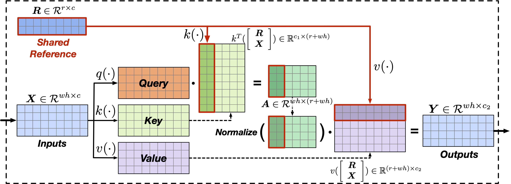

# Augmented Equivariant Attention Networks for Microscopy Image Transformation

This is the official implementation of AEANet in the paper [Augmented Equivariant Attention Networks for Microscopy Image Transformation](https://ieeexplore.ieee.org/stamp/stamp.jsp?arnumber=9785968) accepted by TMI.

<p align="center">
  
</p>

## System Requirements and Environmental setup

We use the same system and environment as the work GVTNets. You can follow the insturctions in [this repo](https://github.com/divelab/GVTNets/) to setup the enviroment.

## Usage

You can follow the example in this [Jypyter notebook](https://github.com/divelab/AEANets/blob/main/model3_pooled_batchatt_lib_kshape.ipynb) for the training and prediction using AEANets to reproduce the results in our paper or on your own data. We have provided the training checkpoints to reproduce the results.

To train the model, simply uncomment the following line in Cell 3

```
model.train(sources, targets, [256,256], validation=(test_X[...,None].astype('float32'), test_Y[...,None].astype('float32')), steps=120000, batch_size=8,seed=1)
```
